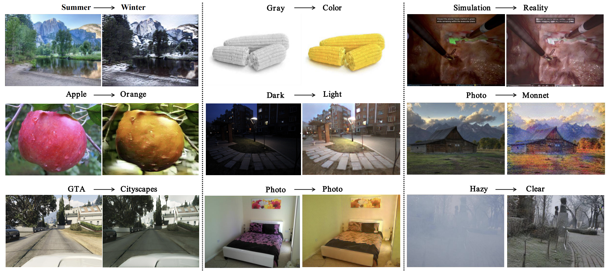
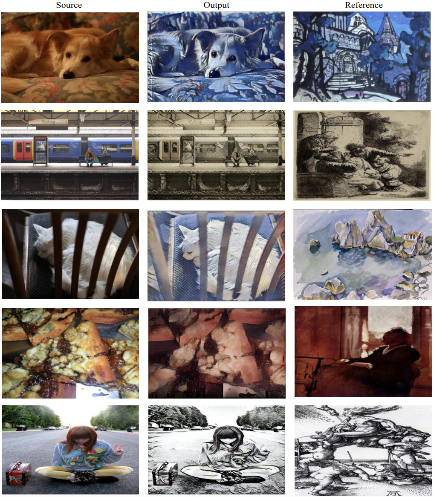
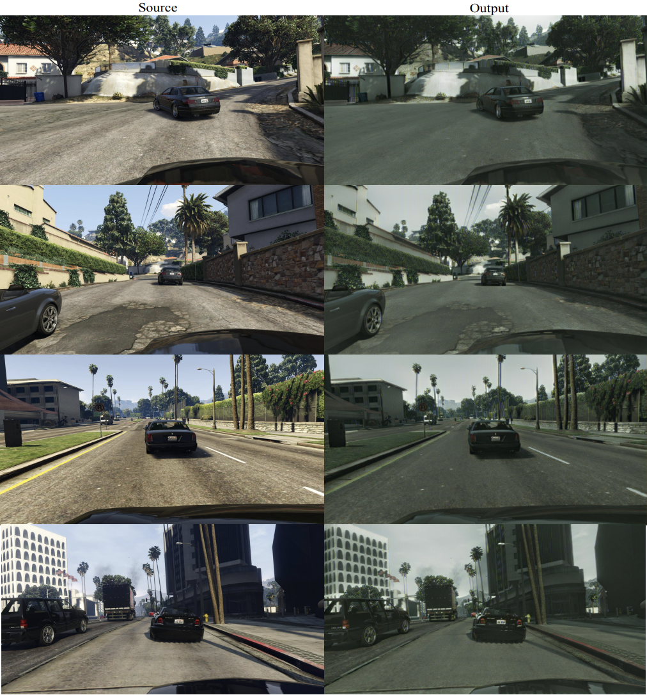
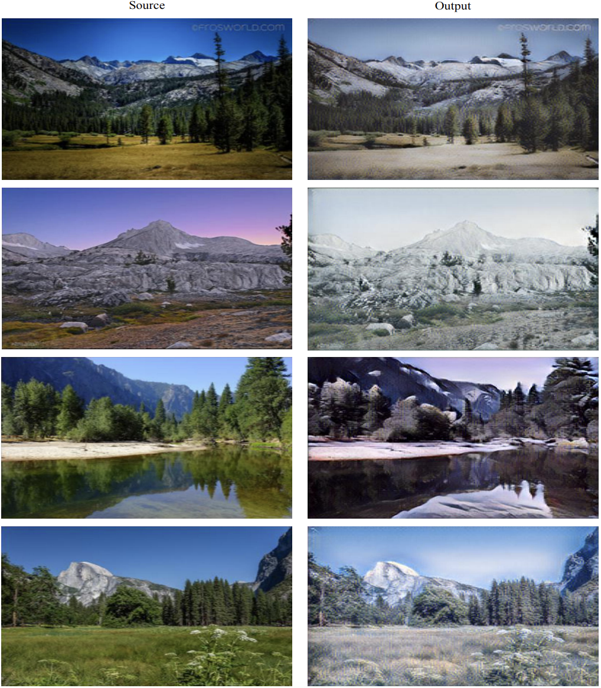
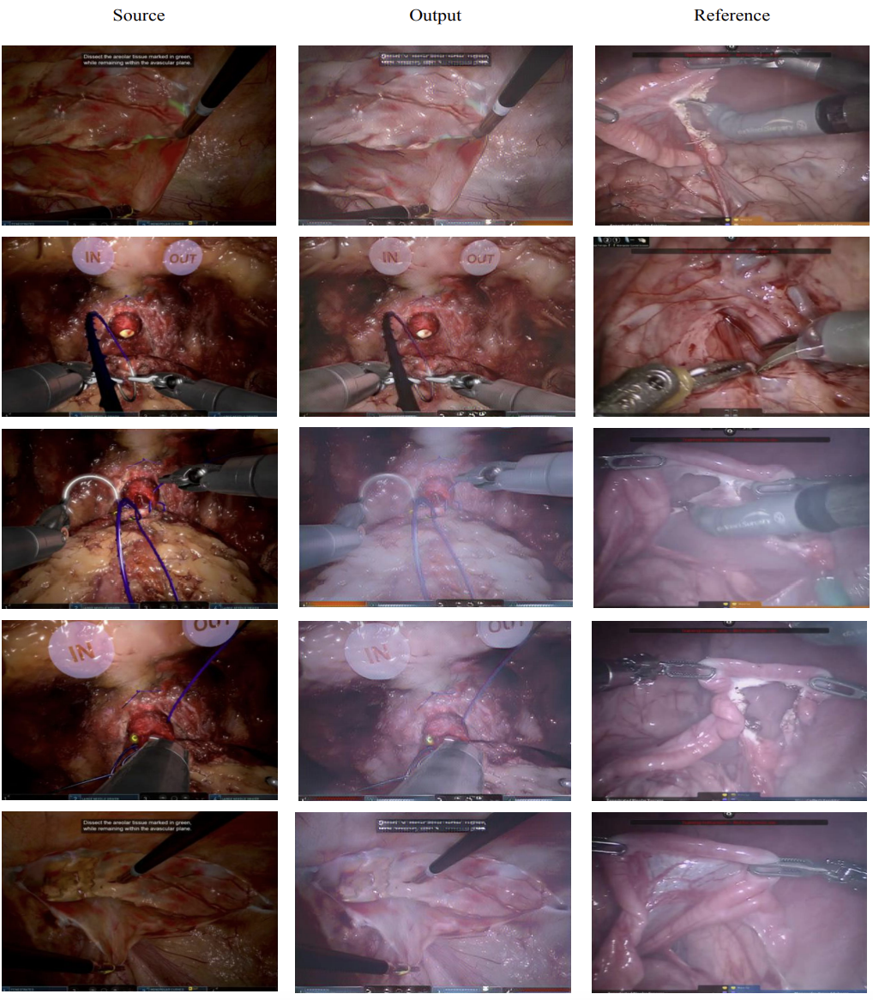

# StyleFlow For Content-Fixed Image to Image Translation
This is the official code for our paper [StyleFlow](https://arxiv.org/abs/2207.01909).

Image-to-image (I2I) translation is a challenging topic in computer vision. We divide this problem into three tasks: strongly constrained translation, normally constrained translation, and weakly constrained translation. The constraint here indicates the extent to which the content or semantic information in the original image is preserved. Although previous approaches have achieved good performance in weakly constrained tasks, they failed to fully preserve the content in both strongly and normally constrained tasks, including photo-realism synthesis, style transfer, and colorization, \etc. To achieve content-preserving transfer in strongly constrained and normally constrained tasks, we propose StyleFlow, a new I2I translation model that consists of normalizing flows and a novel Style-Aware Normalization (SAN) module. With the invertible network structure, StyleFlow first projects input images into deep feature space in the forward pass, while the backward pass utilizes the SAN module to perform content-fixed feature transformation and then projects back to image space. Our model supports both image-guided translation and multi-modal synthesis. We evaluate our model in several I2I translation benchmarks, and the results show that the proposed model has advantages over previous methods in both strongly constrained and normally constrained tasks.
## a. Requirements:
* Python 3.6
* Numpy 1.17.3
* Pytorch 1.5.0
* torchvision 0.6.0
* tensorboard 2.0.0

## b. How to Train
### 1. MS-COCO to WikiArt
* Prepare the dataset
* Prepare the source & target path
~~~ bash
#example
/path/COCO_train2014_000000188902.jpg
/path/COCO_train2014_000000139276.jpg
~~~
* Modify the root path in **wikiart.yaml**
~~~ yaml
rootA: /path/src/train.txt

rootB: /path/target/train.txt
~~~
* run scripts **train_wikiart.sh**

### 2. GTA to Cityscapes
* Prepare the dataset
* Prepare the source & target path
~~~ bash
#example
/path/xxx.jpg
/path/xxx.jpg
~~~
* Modify the root path in **gta.yaml**
~~~ yaml
rootA: /path/src/train.txt

rootB: /path/target/train.txt
~~~
* run scripts **train_gta.sh**

## Test
### a. COCO2WikiArt

* Original setting - using aligned-style loss with keep_ratio equals to 0.8:
1. Download the [pretrained model](https://drive.google.com/file/d/1FWX9Ovu8Z8nmz63b3oXfu1poUA-N2HjY/view?usp=sharing)
2. Replace the **--model path** with the **ckpt path** in test_wikiart.sh
~~~
nohup \
    "python3.6 ../test.py --config=configs/wikiart_origin.yaml --model_path /pretrained model path"&
~~~
3. Run the script:
~~~
cd scripts/
bash test_wikiart.sh
~~~
---
* **[Better Visual Performance]{Recommended}** Optional - using tv loss with keep_ratio equals to 0.6:
1. Download the [pretrained model](https://drive.google.com/file/d/1f-XtXVVVana4PdW5go_NAYTqzZ1_ZACQ/view?usp=sharing)
2. Replace the **--model path** with the **ckpt path** in test_wikiart.sh
~~~
nohup \
    "python3.6 ../test.py --config=configs/wikiart_tv_0.6.yaml --model_path /pretrained model path"&
~~~
3. Run the script:
~~~
cd scripts/
bash test_wikiart.sh
~~~

### b. GTA2Cityscapes & KITTI

Coming soon:)

### c. Summer2Winter

Coming soon:)

### d. Sim2Real

Coming soon:)

## Change Log
* Jul 14, 2022: Initial release
* Aug 20, 2022: Add inference code & pretrained weigths released
* Sep 05, 2022: Modify augmentation
* Sep 05, 2022: Add tv loss & Style-aligned loss configurable
* Sep 05, 2022: new config(wikiart_tv_0.6.yaml) using tv_loss with keep_ratio equals to 0.6
* Sep 05, 2022: original config(wikiart_origin.yaml) using structure_aware_smooth loss with keep_ratio equals to 0.8

## Citation

If you find this repo useful for your research, please cite
~~~ 
@article{fan2022styleflow,
  title={StyleFlow For Content-Fixed Image to Image Translation},
  author={Fan, Weichen and Chen, Jinghuan and Ma, Jiabin and Hou, Jun and Yi, Shuai},
  journal={arXiv e-prints},
  pages={arXiv--2207},
  year={2022}
}
~~~
